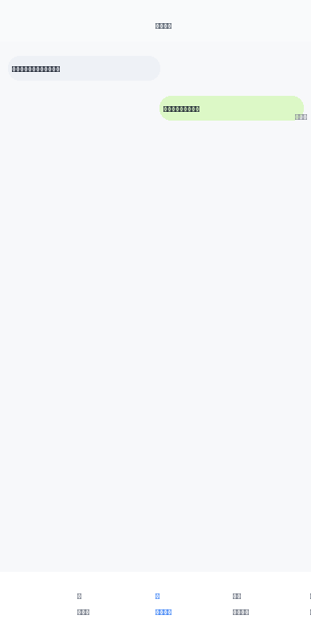

# 高中家校生活模拟器 v2

一个基于需求文档严格实现的高中家校生活模拟器，模拟家长与寄宿制高中孩子的日常交流。

## 🎯 项目特色

- **严格遵循需求文档**：完全按照PRD规范实现所有功能
- **4个核心页面**：家长群、联系孩子、家长操作、孩子状态
- **智能交互系统**：AI驱动的回复生成和数值系统
- **时间段状态机**：支持5个时间段（上课/午休/晚自习/下晚自习/就寝）
- **移动端优化**：专为手机端设计的UI界面

## 🚀 快速开始

1. 克隆仓库
```bash
git clone https://github.com/miaof981-cmd/high-school-family-simulator.git
```

2. 打开 `index.html` 文件即可运行

## 📱 功能演示



## ✨ 核心功能

### 联系孩子页面
- **选项式发言**：支持ABC选项式家长发言
- **智能回复**：基于AI的智能回复生成
- **消息回执**：安静时段显示"已送达"，可聊时段显示"已读"

### 时间段管理
- **上课时间**：孩子专注学习，家长消息标记为已送达
- **午休时间**：孩子可回复，自动处理未读消息
- **晚自习**：安静时段，消息暂存
- **下晚自习**：可聊时段，逐条引用回复
- **就寝时间**：安静时段，消息延迟处理

### 家长操作
- **邮寄物品**：支持多种物品类型邮寄
- **校园卡充值**：实时更新余额
- **电话卡充值**：影响短信功能
- **提供建议**：记录并影响孩子属性

### 孩子状态监控
- **五维属性**：学习、勤奋、社交、独立、正义
- **关系状态**：好感度、信任度
- **资金状况**：家长资金、校园卡、电话卡余额

## 🛠️ 技术实现

- **纯前端实现**：HTML + CSS + JavaScript，无外部依赖
- **AI接口集成**：支持智能回复生成
- **响应式设计**：适配移动端设备
- **状态管理**：完整的数据状态管理系统

## 📋 开发规范

- 严格遵循 `.phone` 容器约束
- 禁止使用 `position: fixed`
- 所有UI元素必须在容器内定位
- 支持多种弹窗关闭方式

## 🧪 测试

项目包含完整的冒烟测试脚本，自动验证：
- UI布局正确性
- 选项数量验证
- 回执显示规则
- 功能完整性

## 📄 文档

- [需求文档](需求文档.prd) - 完整的项目需求规范
- [变更说明](变更说明.md) - 版本更新记录

## 🤝 贡献

欢迎提交Issue和Pull Request来改进项目！

## 📝 许可证

MIT License
